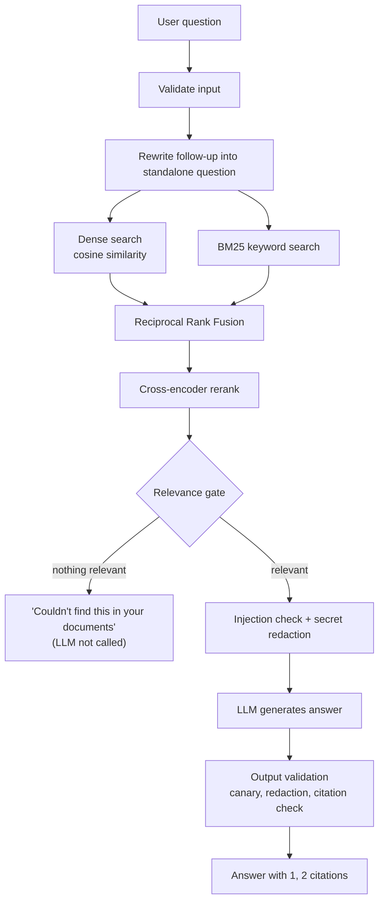

# 📚 SecureRAG: Chat With Your Documents

A conversational, **hybrid-retrieval RAG chatbot** built with **LangChain + LangGraph**. Ask questions about your own PDF, TXT and Markdown files and get answers with page-level citations. It runs on a fully free stack: local embeddings, a local reranker, and either a local LLM (Ollama) or Groq's free tier.

It is also built to be careful. If your documents don't contain the answer, it says so instead of guessing, and it treats uploaded documents as untrusted input.


---

## ✨ Features

- **Hybrid retrieval**: dense semantic search (cosine) plus BM25 keyword search, merged with Reciprocal Rank Fusion. Exact identifiers like `CVE-2025-1234` or `TCP/443` are matched properly.
- **Cross-encoder reranking** of the fused candidates for better precision.
- **Relevance gate**: if no chunk scores above the threshold, the bot answers *"I couldn't find this in your documents"* and **the LLM is never called**.
- **Conversational follow-ups**: questions like *"what about its weaknesses?"* are rewritten into standalone search queries using chat history.
- **Citations with page numbers**, for example `[1] security.pdf, Page 17`. Citations that point to non-existent sources are stripped from the answer.
- **Security layer** (see [below](#-security-model)): untrusted-context prompting, prompt-injection detection, secret/PII redaction, prompt-leak canary, upload validation.
- **Document management**: upload, replace, delete and list documents. Re-indexing is driven by a content hash, so unchanged files are skipped.
- **Built-in evaluation**: Recall@K, MRR, abstention accuracy, keyword coverage, citation rate, latency and optional LLM-judged faithfulness.
- **Streamlit web UI** with four pages (Chat, Documents, Retrieval Debug, Evaluation), a **terminal chat**, chat export to Markdown, file logging, and env-configurable settings.

---

## 🧭 How a Question Flows



The pipeline is a [LangGraph](https://langchain-ai.github.io/langgraph/) state graph with the nodes `rewrite → retrieve → (generate → validate | not_found)`, using in-memory checkpointing for conversation history.

---

## 🚀 Quick Start

### Prerequisites

- Python 3.10+
- One LLM backend:
  - [Ollama](https://ollama.com) (fully local), **or**
  - a free [Groq](https://console.groq.com) API key

### 1. Clone and install

```bash
git clone https://github.com/<your-username>/rag_chatbot.git
cd rag_chatbot

python -m venv .venv
source .venv/bin/activate        # Windows: .venv\Scripts\activate
pip install -r requirements.txt
```

### 2. Configure

```bash
cp .env.example .env
```

**Option A: Ollama (local, no key)**

```bash
ollama pull llama3.2
# .env already defaults to LLM_PROVIDER=ollama, LLM_MODEL=llama3.2
```

**Option B: Groq (free tier)**

```env
LLM_PROVIDER=groq
GROQ_API_KEY=your_key_here
# LLM_MODEL defaults to llama-3.3-70b-versatile
```

### 3. Add documents and run

Drop your `.pdf`, `.txt` or `.md` files into a `docs/` folder (created automatically on first run), or upload them from the web UI.

```bash
streamlit run app.py     # web UI
python cli.py            # terminal chat (add --reindex to rebuild the index)
```

> The first run downloads the embedding model and reranker (about 100 MB in total).

---

## 🖥️ Web UI

| Page | What it does |
|------|--------------|
| **Chat** | Conversational Q&A with streamed answers, expandable source passages, security warnings, and chat export (`.md`). |
| **Documents** | Upload multiple files, see what's indexed (with chunk counts), replace or delete documents. |
| **Retrieval Debug** | Inspect dense / BM25 / fused / rerank scores for any query and see why the relevance gate passed or failed. |
| **Evaluation** | Run your evaluation dataset and view metrics without leaving the browser. |

---

## ⚙️ Configuration

All settings live in `rag/config.py` and can be overridden with environment variables or a `.env` file.

| Variable | Default | Description |
|----------|---------|-------------|
| `LLM_PROVIDER` | `ollama` | `ollama` or `groq` |
| `LLM_MODEL` | `llama3.2` (Ollama) / `llama-3.3-70b-versatile` (Groq) | Chat model name |
| `GROQ_API_KEY` | – | Required only for Groq |
| `EMBED_MODEL` | `sentence-transformers/all-MiniLM-L6-v2` | Local embedding model |
| `RERANKER_ENABLED` | `true` | Toggle the cross-encoder reranker |
| `RERANKER_MODEL` | `cross-encoder/ms-marco-MiniLM-L-6-v2` | Cross-encoder model |
| `TOP_K` | `6` | Chunks sent to the LLM |
| `CANDIDATES` | `20` | Candidates taken from *each* retriever |
| `RERANK_CANDIDATES` | `20` | Fused candidates passed to the reranker |
| `RRF_K` | `60` | Reciprocal-rank-fusion constant |
| `MIN_RERANK_SCORE` | `0.05` | Relevance gate threshold (with reranker) |
| `MIN_DENSE_SIMILARITY` | `0.25` | Relevance gate threshold (without reranker) |
| `CHUNK_SIZE` / `CHUNK_OVERLAP` | `1000` / `150` | Chunking (changing these needs a re-index) |
| `MAX_TOKENS` / `TEMPERATURE` | `1500` / `0.3` | Generation settings |
| `OLLAMA_NUM_CTX` | `8192` | Context window for Ollama |
| `INJECTION_ACTION` | `flag` | `flag` (warn and mark) or `drop` (remove the passage) |
| `REDACT_CONTEXT` | `auto` | `auto` (only for remote LLMs), `true`, or `false` |
| `MAX_FILE_SIZE_MB` | `25` | Upload size limit |
| `MAX_QUERY_CHARS` | `2000` | Question length limit |
| `LOG_LEVEL` | `INFO` | Logs are written to `logs/rag.log` |

> **Re-indexing:** after changing `CHUNK_SIZE`, `CHUNK_OVERLAP` or `EMBED_MODEL`, delete the `chroma_db/` folder (or run `python cli.py --reindex`).

---

## 🔒 Security Model

Uploaded documents are treated as **untrusted**. They might contain instructions aimed at the LLM (indirect prompt injection) or secrets that shouldn't leave your machine.

| Layer | What it does |
|-------|--------------|
| **Input validation** | Strips control characters and enforces a query length limit. |
| **Upload validation** | Sanitises file names, restricts extensions to PDF/TXT/MD, enforces size limits, and checks the PDF magic bytes. |
| **Untrusted-context prompt** | The system prompt tells the model that retrieved text is *data*, never instructions. |
| **Injection detection** | Pattern-based detection of phrases like "ignore previous instructions". Passages are flagged (default) or dropped. |
| **Secret / PII redaction** | Masks API keys, tokens, private keys, JWTs, passwords and emails before text is sent to a **remote** LLM (automatic for Groq, off by default for local Ollama). |
| **Prompt-leak canary** | A random marker in the system prompt. If it appears in an answer, the answer is blocked. |
| **Output validation** | Redacts sensitive values in answers and removes citations to non-existent sources. |

> ⚠️ This is **defence in depth, not a guarantee**. Regex-based injection detection can be evaded.

---

## 📊 Evaluation

Tune the thresholds on **your own documents** before trusting them.

1. Edit `evaluation/dataset.json` with questions about your docs:
   - `expected_sources`: file names that should be retrieved
   - `expected_keywords`: words a good answer should contain
   - `"answerable": false`: a few questions your docs do **not** cover (tests that the bot abstains)
2. Run it:

```bash
python -m evaluation.evaluate                        # retrieval metrics only (fast)
python -m evaluation.evaluate --generate             # also generate answers
python -m evaluation.evaluate --generate --judge     # plus LLM-judged faithfulness
```

Results are printed and saved to `evaluation/results.json`. You can also run evaluations from the **Evaluation** page in the UI.

3. Use the **Retrieval Debug** page to inspect scores, then tune:
   - Too many "not found" on answerable questions → **lower** `MIN_RERANK_SCORE` / `MIN_DENSE_SIMILARITY`
   - Answers to unanswerable questions → **raise** them

---

## 🗂️ Project Structure

```
rag_chatbot/
├── app.py                  # Streamlit web UI
├── cli.py                  # Terminal chat
├── requirements.txt
├── .env.example
├── docs/                   # Your documents (git-ignored)
├── evaluation/
│   ├── dataset.json        # Evaluation questions (edit this)
│   └── evaluate.py         # Evaluation CLI
├── tests/                  # Pytest suite
└── rag/
    ├── config.py           # All settings (env-overridable)
    ├── ingestion.py        # Upload validation, hashing, chunking
    ├── vectorstore.py      # Embeddings + Chroma (index / update / delete / list)
    ├── retrieval.py        # BM25 + dense + RRF + rerank + relevance gate
    ├── reranker.py         # Cross-encoder reranker
    ├── query.py            # Follow-up question rewriting
    ├── security.py         # Injection detection, redaction, output validation
    ├── graph.py            # LangGraph pipeline
    ├── citations.py        # Citation formatting
    ├── llm.py              # LLM provider selection (add new providers here)
    ├── system.py           # Builds the full system (shared by UI, CLI, eval)
    ├── evaluation.py       # Evaluation metrics
    └── logging_config.py
```

---

## 🧪 Testing

```bash
python -m pytest -q
```

The tests run without downloading any models.

---

## ⚠️ Known Limitations

- Relevance thresholds are starting points; tune them for your documents.
- The retrieval index is held **in memory**. This is fine for tens of thousands of chunks; beyond that, move to Chroma-side queries plus a dedicated BM25 service.
- Prompt-injection detection is pattern-based and can be evaded. It is one layer, not a guarantee.
- Chunking is character-based and not structure-aware, so sections and tables aren't respected.
- Scanned PDFs (no text layer) are rejected, because there is no OCR.
- LLM-judged faithfulness is noisy; use it to compare versions, not as absolute truth.

---

## 🛠️ Tech Stack

[LangChain](https://www.langchain.com/) · [LangGraph](https://langchain-ai.github.io/langgraph/) · [Chroma](https://www.trychroma.com/) · [Sentence-Transformers](https://www.sbert.net/) · [Ollama](https://ollama.com) / [Groq](https://groq.com) · [Streamlit](https://streamlit.io) · [pypdf](https://pypdf.readthedocs.io/)

---

## 🤝 Contributing

Issues and pull requests are welcome. Please run `python -m pytest -q` before submitting a PR.
